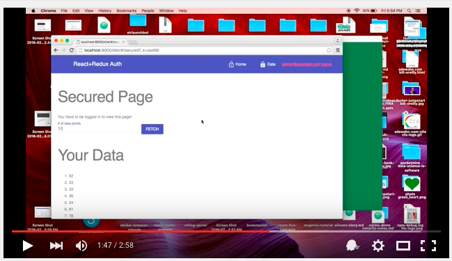

This repo is a demonstration / sketch for a react+redux frontend with a golang API  backend that demonstrates:

* Use of higher-level components to protect pages in the frontend that require authorization
* react-mdl for the design
* React router to route stuff
* Redux and redux-thunk for state management
* Multiple redux reducers using `combineReducers`
* UI handling for long running API calls
* [JWT](http://jwt.io/) signing for authenticating API calls
* Proper handling for CORS in Gorilla mux
* Setting headers with `fetch` API
* An npm `scripts` based build approach with support for watchify and gin

I set it up to server as a micro-lab for working with various authentication options.  It took me a lot of research to get all the tiny details right (especially the CORS, JWT, and react login stuff), so I thought I'd share it.

This video provides an overview of the app:

If there is interest, I'll make another post / video with more detail on how things work.  *So, if you want to see that, star the repo!*

## To run it

First, you need a working Golang environment (1.5+)
* Clone the repo
* `npm install`
* `npm run frontend`
* `go get` to download the go packages

Open your browser to `localhost:8000/dist`

## What's Missing

I should also add this stuff

* Godeps support
* Encryption / HTTPS support for the API
* Encryption for the JWT token
